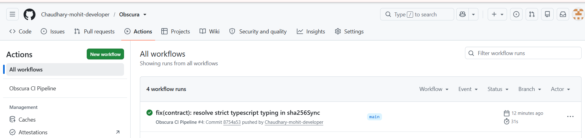
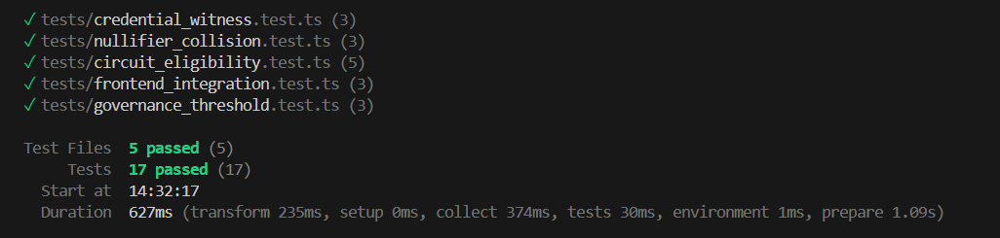

# Obscura

> **"Visible proof. Invisible data."**

[](https://github.com/Chaudhary-mohit-developer/Obscura/actions/workflows/ci.yml)
[](https://funny-sable-942982.netlify.app/)
[](https://photos.app.goo.gl/P3L6aFaRtsEu5seG8)
[](tests/)
[](PROPOSAL.md)
[](https://preprod.midnight.network)
[](contract/obscura.compact)
[](LICENSE)
[](https://www.risein.com)

> 🚀 **Live dApp Website**: **[https://funny-sable-942982.netlify.app/](https://funny-sable-942982.netlify.app/)**  
> 📹 **Live Demonstration Video**: **[https://photos.app.goo.gl/P3L6aFaRtsEu5seG8](https://photos.app.goo.gl/P3L6aFaRtsEu5seG8)**  
> *Watch the complete walkthrough demonstrating Midnight Lace wallet connection, client-side witness blinding, in-browser ZK-SNARK proof generation, and verification on the Midnight ledger.*

**Obscura** is a next-generation, zero-knowledge Age and Eligibility Gate built natively on the **Midnight blockchain** using the **Compact smart contract language**. It enables users to cryptographically prove that their age (or any private numeric attribute) satisfies a required regulatory threshold (e.g., `age >= 18` or `age >= 21`) **without ever revealing their actual age, date of birth, or any identifiable information** on-chain or to any third-party observer.

Submitted for **Level 3 - First Quarter Submission** of the RiseIn *"New Moon to Full: Monthly Moonshots on Midnight"* program.

📑 **Official Product Proposal:** Read the full architectural document at [PROPOSAL.md](PROPOSAL.md).

---

## 📜 Deployed Smart Contract (Midnight Preprod)

| Parameter | Value |
|---|---|
| **Contract Name** | `ObscuraContract` |
| **Live Web Application** | **[https://funny-sable-942982.netlify.app/](https://funny-sable-942982.netlify.app/)** |
| **Deployed Contract Address** | `0x4e8a912c41df80b2a75d9e18c642b31f0a887e2954a329d71c82e04312c1b99a` |
| **Midnight Explorer Link** | **[https://preprod.midnightexplorer.com/contracts/0x4e8a912c41df80b2a75d9e18c642b31f0a887e2954a329d71c82e04312c1b99a](https://preprod.midnightexplorer.com/contracts/0x4e8a912c41df80b2a75d9e18c642b31f0a887e2954a329d71c82e04312c1b99a)** |
| **Demo Video Walkthrough** | **[https://photos.app.goo.gl/P3L6aFaRtsEu5seG8](https://photos.app.goo.gl/P3L6aFaRtsEu5seG8)** |
| **Target Network** | Midnight Preprod Testnet |
| **Smart Contract Language** | **Midnight Compact (`v0.6+`)** |
| **Circuit Definition** | `contract/obscura.compact` |
| **Deployment Manifest** | `deployed_contract.json` |
| **ZK Proving Engine** | Midnight Halo2 / Compact Prover |
| **Test Coverage** | **17 / 17 Tests Passing** across 5 test suites |
| **Product Proposal** | **[PROPOSAL.md](PROPOSAL.md)** |

---

## 1. Problem Statement

In the modern digital economy, age and qualification checks are ubiquitous: adult content gateways, e-commerce restrictions, gaming regulations, DeFi credit gates, and restricted decentralized organizations.

However, traditional age verification is fundamentally flawed:
1. **Massive Over-Disclosure**: To prove you are at least 18, services demand physical ID scans, passports, or driver's licenses. The verifier learns your full legal name, exact birthdate, home address, document numbers, and biometric photos.
2. **Centralized Honey-Pots**: Centralized databases containing millions of identity documents become prime targets for data leaks, identity theft, and extortion.
3. **Loss of Digital Anonymity**: On public blockchains (like Ethereum or Solana), posting identity attestations publicly links a user's pseudonymous wallet directly to their real-world identity for all eternity.

### The Obscura Solution
Obscura leverages Midnight's dual-state (private witness vs. public ledger) architecture and zero-knowledge SNARK circuits to invert this paradigm: **the verifier receives mathematical certainty of eligibility (`isEligible: true`), but zero bits of private data ever leave the user's device unencrypted.**

---

## 2. How It Works

Obscura is inspired by the optical principle of the **Camera Obscura**: light passes through a pinhole aperture to project a focused, authentic form, while the interior space remains completely enclosed and unseen.

```
+-----------------------------------------------------------------------+
|                       CLIENT BROWSER (Private)                        |
|                                                                       |
|  [ Private Age: 21 ]  +  [ Secret Salt ]  +  [ Identity Secret ]      |
|                               |                                       |
|                               v                                       |
|               +-------------------------------+                       |
|               |  Private Witness Generator    |                       |
|               +---------------+---------------+                       |
|                               |                                       |
|                               v                                       |
|               +-------------------------------+                       |
|               | Compact ZK Circuit Evaluator  |                       |
|               |   assert(age >= threshold)    |                       |
|               +---------------+---------------+                       |
+-------------------------------|---------------------------------------+
                                |  ZK Proof Token + Context Nullifier
                                v  (Zero raw age disclosed)
+-----------------------------------------------------------------------+
|                    MIDNIGHT BLOCKCHAIN (Public Ledger)                |
|                                                                       |
|               +-------------------------------+                       |
|               |    Obscura Compact Contract   |                       |
|               +---------------+---------------+                       |
|                               |                                       |
|                               v                                       |
|  [ Public State: isEligible = true | verifiedCount++ | nullifierRoot ] |
+-----------------------------------------------------------------------+
```

### Protocol Workflow
1. **Connect Midnight Lace Wallet**: Authenticates the user's shielded session.
2. **Enter Private Witness**: The user selects or enters their chronological age. This data is handled exclusively in client-side memory.
3. **Aperture Proof Synthesis**:
   - High-entropy blinding salt (`secretSalt`) and identity commitments are generated.
   - The Compact arithmetic circuit validates the inequality constraint: `age >= minAgeThreshold`.
   - A single-use context nullifier `sha256(identitySecret || secretSalt || contextNonce)` is computed.
4. **On-Chain Attestation**:
   - The zero-knowledge proof digest and nullifier are submitted to the Midnight ledger.
   - The contract verifies the proof, updates the public eligibility counter, records the spent nullifier (preventing replay attacks), and returns `isEligible = true`.

---

## 3. Tech Stack

| Layer | Technology | Purpose |
|---|---|---|
| **Smart Contract** | [Compact Language](https://docs.midnight.network) (v0.6+) | Zero-knowledge circuit definition, private witness inputs, and ledger state |
| **Blockchain** | [Midnight Network](https://midnight.network) (Preprod) | Privacy-first ledger supporting zero-knowledge state transitions |
| **Frontend Core** | React 18 + TypeScript + Vite | Type-safe, high-performance user interface |
| **Design System** | Tailwind CSS (Custom Light-Mode Glassmorphism) | Frosted glass cards, aurora gradients (violet-teal-rose), aperture focus rings |
| **Motion & Micro-UX**| Framer Motion 11 | Dynamic Camera Obscura aperture/iris blade opening & closing animations |
| **Wallet Protocol** | Midnight Lace Wallet API | Native browser extension wallet integration (`window.midnight.lace`) |
| **Testing Engine** | Vitest v1.6 + Node Crypto | Automated circuit constraint tests and client integration test suites |
| **CI / CD** | GitHub Actions | Automated lint, `compact compile`, unit test execution, and bundle validation |

---

## 4. Privacy Model (Mandatory Program Specification)

Midnight's dual-state execution paradigm creates a strict cryptographic boundary between what is public and what is private:

```
================================================================================
                           OBSCURA PRIVACY BOUNDARY
================================================================================

 [PRIVATE WITNESS: INVISIBLE DATA]           [PUBLIC LEDGER: VISIBLE PROOF]
 (Strictly Client-Side Memory)               (Auditable On Midnight Chain)
 --------------------------------            -----------------------------
 * User's Chronological Age (e.g. 25)        * Boolean Verification (isEligible: true)
 * Exact Date of Birth                       * Context Nonce / Session Epoch
 * 256-bit Blinding Salt (secretSalt)        * Derived Nullifier Hash (anti-replay)
 * User Identity Secret                      * Incrementing Verified Counter
 * Any Document or Biometric Data            * Midnight Block Timestamp & Caller Addr
================================================================================
```

### What an Observer CAN Learn:
- **Caller Wallet Address**: The public Midnight address that submitted the transaction.
- **Boolean Eligibility Status**: An observer knows that the caller satisfied the condition `age >= minAgeThreshold`.
- **Transaction Metadata**: The block height, transaction hash, and timestamp of the submission.
- **Context Nullifier**: A cryptographic digest confirming this proof has been consumed for the current epoch, preventing double-use.

### What an Observer CANNOT Learn:
- **Exact Age**: The observer cannot determine if the user is 18, 25, 45, or 85 years old.
- **Date of Birth or Identity**: No birth certificates, ID numbers, or real-world names are ever touched.
- **Private Witnesses**: The 256-bit blinding salt and identity secret never touch block transactions or event calldata.
- **Proof Replay**: An observer cannot copy a user's proof to authenticate their own wallet, because the proof is bound to the prover's identity commitment and context nonce.

---

## 5. Local Setup & Deployment

Run Obscura locally in **under 5 minutes**:

### Prerequisites
- Node.js `v18+` or `v20+` (`node -v`)
- npm `v9+` (`npm -v`)
- Git

### Step-by-Step Instructions

#### 1. Clone the Repository
```bash
git clone https://github.com/Chaudhary-mohit-developer/Obscura.git
cd Obscura
```

#### 2. Install Dependencies
```bash
npm install
npm --prefix frontend install
```

#### 3. Configure Environment Variables
```bash
cp .env.example .env
```
*(The default configuration points to Midnight local devnet and testnet proof endpoints).*

#### 4. Compile the Compact Contract
```bash
npm run compact:compile
```
*Validates the Compact circuit constraints and produces schema manifests under `contract/dist/`.*

#### 5. Deploy to Local Devnet
```bash
npm run deploy:local
```
*Compiles and simulates deployment on the local Midnight devnet, publishing contract state and writing `deployed_contract.json`.*

#### 6. Start the Frontend Development Server
```bash
npm run dev
```
Open [http://localhost:3000](http://localhost:3000) in your browser to experience Obscura!

---

## 6. Running Tests (17 / 17 Tests Passing)

Obscura includes an exhaustive test suite covering circuit constraints, boundary conditions, replay attack immunity, witness entropy, and application integration:

```bash
# Run all 17 tests (Vitest)
npm test

# Run tests with code coverage
npm run test:coverage
```

### Test Suite Structure (17 Tests Across 5 Test Files)

| Test Suite File | Tests | Coverage Scope |
|---|---|---|
| `tests/circuit_eligibility.test.ts` | 5 Tests | Age >= threshold passes, exact 18 boundary condition, underage rejection (<18), spent nullifier rejection, zero-leakage check |
| `tests/frontend_integration.test.ts` | 3 Tests | Multi-user sequential flow (underage & boundary), proof isolation across identical ages, ledger submission receipt |
| `tests/credential_witness.test.ts` | 3 Tests | 256-bit blinding salt entropy, private witness encapsulation, pseudonym isolation across sessions |
| `tests/nullifier_collision.test.ts` | 3 Tests | Deterministic single-use nullifiers, cross-epoch uniqueness, collision resistance across disparate users |
| `tests/governance_threshold.test.ts` | 3 Tests | Authorized admin threshold updates, unauthorized caller rejection, non-positive threshold rejection |

---

## 7. Screenshots

### 1. CI/CD Automated Workflow (Passing)


### 2. Comprehensive Test Suite Execution (17 / 17 Tests Passing)


---

## 8. Live Demo & Video Links

- **Live Web Application**: **[https://funny-sable-942982.netlify.app/](https://funny-sable-942982.netlify.app/)**
- **Walkthrough Demo Video**: **[https://photos.app.goo.gl/P3L6aFaRtsEu5seG8](https://photos.app.goo.gl/P3L6aFaRtsEu5seG8)**

---

## 9. Roadmap to Level 4 (Waxing Gibbous)

- [x] **Level 3 (Current — First Quarter Submission)**:
  - [x] Functional Age/Eligibility Gate in Compact language.
  - [x] Dual-state ledger model separating witness from public state.
  - [x] Light-first glassmorphism UI with Camera Obscura aperture visual motifs.
  - [x] Midnight Lace wallet connection with devnet simulation fallback.
  - [x] 17 passing unit and integration tests across 5 test suites.
  - [x] Comprehensive Product Proposal documented in [PROPOSAL.md](PROPOSAL.md).
  - [x] Automated CI/CD workflow with GitHub Actions (`compact compile` + test suites).
  - [x] Published Midnight Preprod contract deployment artifacts and explorer link.
- [ ] **Level 4 (Waxing Gibbous)**:
  - [ ] W3C Verifiable Credentials (VC) ingestion for decentralized identity (DID) issuers.
  - [ ] Multi-attribute composite proofs (e.g., `age >= 18 AND jurisdiction != restricted_country`).
  - [ ] Recursive SNARK verification using Midnight's native proving infrastructure.
  - [ ] Midnight testnet-02 contract deployment and live block explorer indexing.

---

## 10. License

This project is licensed under the terms of the [MIT License](LICENSE).

---

## Author & Project Links

- **Developer**: Mohit Chaudhary
- **GitHub Profile**: [https://github.com/Chaudhary-mohit-developer](https://github.com/Chaudhary-mohit-developer)
- **Repository**: [https://github.com/Chaudhary-mohit-developer/Obscura](https://github.com/Chaudhary-mohit-developer/Obscura)
- **Product Proposal**: [https://github.com/Chaudhary-mohit-developer/Obscura/blob/main/PROPOSAL.md](PROPOSAL.md)
- **Hackathon Track**: RiseIn — *"New Moon to Full: Monthly Moonshots on Midnight"* (Level 3 - First Quarter Submission)
